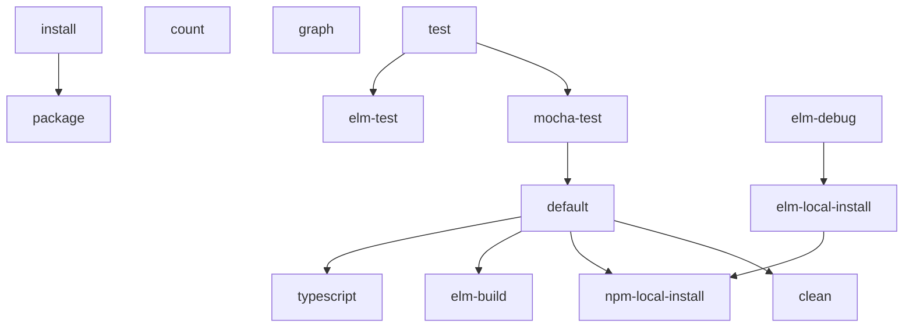

# Makefile.md

```mermaid
graph TD
  default --> clean
  default --> npm-local-install
  default --> elm-build
  default --> typescript

  test --> mocha-test
  mocha-test --> default
  test --> elm-test

  count

  _["graph"]

  install --> package

  elm-debug --> elm-local-install
  elm-local-install --> npm-local-install
```
